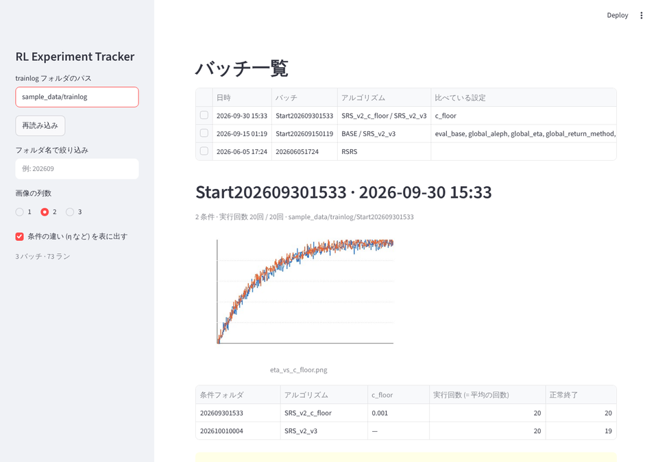
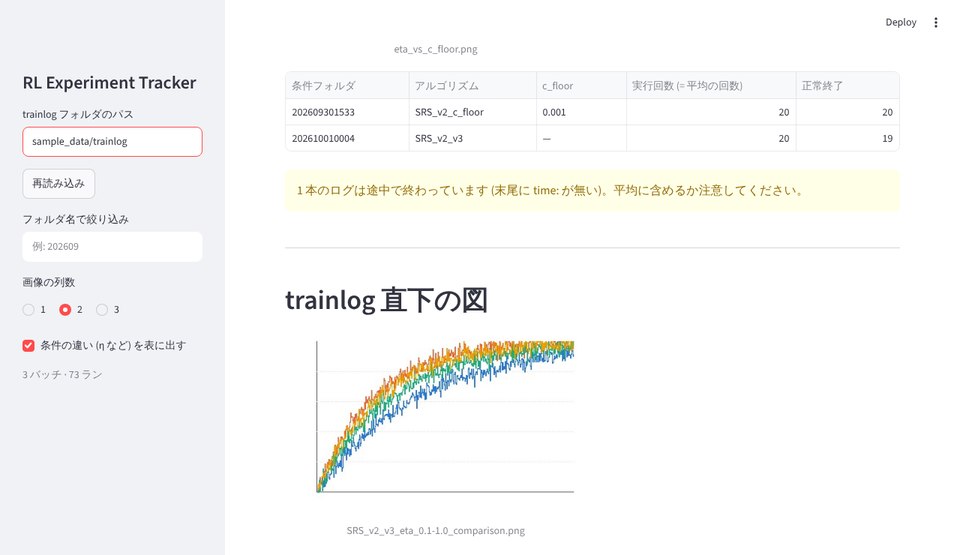

# RL Experiment Tracker

> A small, local-only Streamlit viewer for reinforcement-learning experiment backups (HandyRL `trainlog/`).
> For each experiment batch it shows the figures you saved and how many runs each condition was averaged over.
> Built to stop digging through backup folders by hand during my own RL research (SRS_v2). Read-only; nothing leaves your machine.


強化学習の実験バックアップ（HandyRL の `trainlog/`）を読み、**バッチごとに保存した図**と**各条件を何回回したか（= 何回平均の結果か）**を一目で確認する小さな Streamlit アプリです。自分の研究（SRS_v2 アルゴリズム）で日常的に使っています。

## なぜ作ったか

研究室の実験スクリプトは、標準出力を `trainlog/Start<日時>/<日時>/train_log_XX.txt` に保存するだけで、実験管理ツールは使っていません。比較の図は matplotlib で描いて `Start` フォルダに手で置いています。

その結果、1 か月後に「η=0.2 は何回回したっけ」「この図はどの条件を比べたものだっけ」と確認するたびに、Finder でフォルダを開いて config と log の末尾を目で追う作業が発生していました。これを **1 分以内に答えられる状態**にするのが目的です。

## 作る過程で削ったもの

最初は「実験管理ツール」として、ラン一覧・ハイパーパラメータでの絞り込み・学習曲線の重ね描き・平均±標準偏差・条件横断の集計まで作りました（約 2,500 行。git の最初のコミット `dd3ead9` に `archive_v1/` として残しています）。

数日使って分かったのは次のことです。

- 学習曲線は研究用スクリプトですでに描いて png を保存している。アプリでもう一度描く意味がなかった
- 実際に毎回見ていたのは「保存した図」と「何回平均か」の 2 つだけだった
- 機能が増えるほど、自分で全部説明できるコードではなくなっていった

そこで機能を 2 つに絞り、3 ファイル・約 380 行に作り直しました。足す判断より削る判断の方が難しく、この経験がこのプロジェクトで一番の学びです。

## 画面

| 一覧から選ぶ → そのバッチの図と条件 | 条件ごとの実行回数と、途中で止まったログの警告 |
|---|---|
|  |  |

画面は上から「バッチ一覧（1 行 = 実験スクリプト 1 回分）」→「選んだバッチの図と、条件フォルダごとの表」→「trainlog 直下の図」です。表には同じバッチ内で**設定が異なる項目だけ**（η など）が列として出るので、その図が何を比べたものか分かります。

## 使い方

```bash
git clone https://github.com/kkambayashi/rl-experiment-tracker.git
cd rl-experiment-tracker
uv sync --extra dev            # 初回のみ (pip なら: pip install -r requirements.txt)
uv run streamlit run app.py
```

`~/Desktop/SRS_v2_backup/trainlog` があればそこを、無ければ同梱の `sample_data/trainlog`（合成データ）を読みます。サイドバーで別のパスを指定できます。Mac では `アプリを起動.command` をダブルクリックしても起動します。

テスト:

```bash
uv run pytest -q
```

## 対応しているバックアップの構造

```
trainlog/
  Start202609301533/            # バッチ (実験スクリプト 1 回分)
    202609301533/               # 条件 (config 1 つ分)
      config_01.yaml
      train_log_01.txt ... train_log_20.txt   # 本数 = その条件を回した回数
    eta_vs_c_floor.png          # 手作業で保存した図
  202606051724/                 # 旧形式 (trainlog 直下に条件フォルダ) も可
  SRS_v2_v3_eta_...png          # trainlog 直下の図
```

## 仕組み

| ファイル | 役割 | 行数 |
|---|---|---|
| `scan.py` | `trainlog/` を走査し、バッチ → 条件の 2 階層にまとめる。Streamlit に依存しない純粋な Python | 約 170 行 |
| `app.py` | 画面。`scan()` の結果を一覧表にし、選ばれたバッチを表示する | 約 130 行 |
| `test_scan.py` | `scan.py` のテスト。一時フォルダに小さな `trainlog` を作って確認する | 約 80 行 |

`scan.py` で決めていること:

- **実行回数** は `train_log_*.txt` のファイル本数。それ以上の解釈はしない
- **正常終了** はログ末尾 300 バイトに `time :` があるか（HandyRL が終了時に出力する）。全文は読まないので 840 ランでも 1 秒以内
- **設定**（アルゴリズム・η など）は `train_log_01.txt` の 1 行目にある実行時の設定 dict を `ast.literal_eval` で復元。読めなければ「不明」と表示し、推測で埋めない
- **条件の違い** はバッチ内で設定が異なるキー（片方の条件にしか無いキーを含む）だけを抽出。サーバーアドレスなど実験条件でない物は除外

## 制約

- 実行回数はファイル本数なので、途中で止まったログも含みます。`正常終了` 列と合わせて見てください
- seed は研究コードの仕様で全実験 0 のため表示していません（run 間の違いは run 番号）
- zip のみ残っているバッチ、Git コミット ID、実験メモはバックアップに情報が無いため扱いません
- 対応形式は HandyRL の `trainlog/` のみです

## 既存ツールとの違い

MLflow や Weights & Biases は学習コード側にロギングを組み込む前提で、過去のバックアップを後から読むには変換が必要です。このアプリは研究コードを一切変更せず、すでにあるフォルダをそのまま読みます。逆に、リアルタイム監視やチーム共有は目的にしていません。

## AI の利用について

Claude（Anthropic）と対話しながら開発しました。

- **AI が担当**: 実データのフォルダ構造の調査、`scan.py` / `app.py` / テストの初版、サンプルデータ、画面キャプチャ
- **自分が判断**: 最低限の機能を 2 つに絞ること、多機能版を捨てること、「実行回数 = ファイル本数」「未完了ログは別に数える」という定義、一覧から選ぶ UI
- **自分で実装**: 一覧表からの選択機能（AI に手順とコード例を聞きながら）、git 管理と不要ファイルの整理

生成されたコードはそのまま使わず、各ファイルの役割と処理を自分で説明できる状態にすることを優先しました。

## ライセンス

MIT
