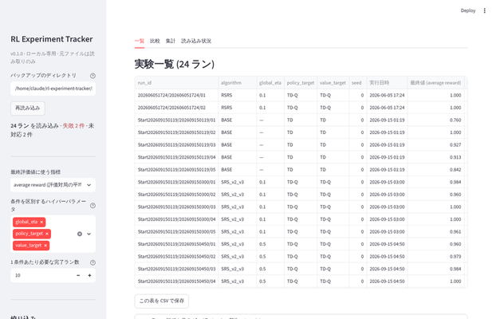
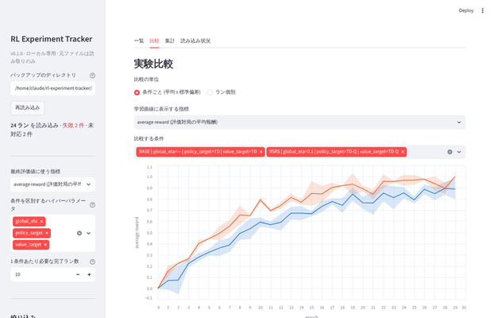
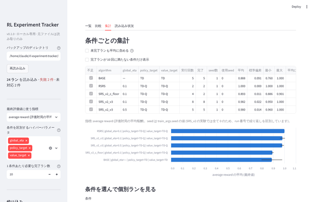
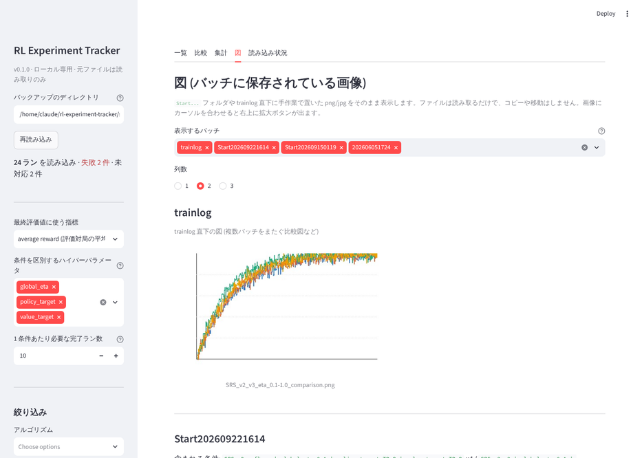
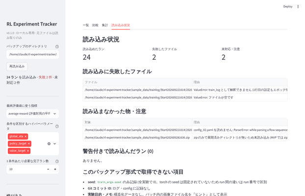

# RL Experiment Tracker

強化学習アルゴリズム SRS_v2 の実験バックアップ (HandyRL の `trainlog/`) をローカルで読み込み、
**「どのハイパーパラメータの組み合わせを、何回・何 seed で実行し、結果はどうだったか」** を 1 分以内に確認するための Streamlit アプリです。



## 解決したかった問題

研究室の実験は `bash_scripts/experiment_config.sh` が `trainlog/Start<日時>/<日時>/train_log_XX.txt` という形で標準出力を保存するだけで、実験管理ツールは使っていません。
そのため「η=0.2 の実験は何回回したか」「c_floor を入れる前後で何が変わったか」を調べるたびに、
バックアップのディレクトリを開いて config.yaml とログの末尾を目で確認していました。

このアプリは **既存のバックアップを変更せず、後から読み込んで** 検索・比較・集計できるようにします。

## 想定ユーザー

- 自分 (SRS_v2 の実験を回し、結果を比較する人)
- 同じ HandyRL ベースのコードで実験している研究室のメンバー

## 主な機能

| 画面 | できること |
|---|---|
| 一覧 | 全ランの表 (アルゴリズム・主要ハイパーパラメータ・seed・実行日時・最終評価値・実行状態・元ファイル)。CSV 保存。1 ランの全パラメータと警告の確認 |
| 比較 | 条件 (またはラン) を選んで学習曲線を重ねる。条件ごとは平均 ± 標準偏差の帯。最終値・実行回数・seed 数・ハイパーパラメータの差分・一部の実験にしか無いパラメータ (欠損条件) の表示 |
| 集計 | 条件ごとの実行回数・完了数・使用 seed・平均・標準偏差・最小/最大。必要ラン数に満たない条件の抽出。条件を選んで個別ランを表示 |
| 図 | `Start...` フォルダや trainlog 直下に手作業で保存した png/jpg を、バッチに含まれる条件と一緒にギャラリー表示。一覧の詳細・比較画面からも関係する図を参照 |
| 読み込み状況 | 読み込みに失敗したファイルと理由、未対応の物 (zip のみのバッチ)、警告付きで読み込んだラン |

サイドバーで、アルゴリズム・seed・実行状態・バッチ・任意のハイパーパラメータで絞り込めます。
最終評価値に使う指標 (average reward / win rate / generation stats / 各 loss) は切り替え可能です。

## 使用技術

Python 3.10+ / Streamlit / pandas / Altair / PyYAML / pytest。
大きなフレームワークや DB は使っていません (第 2 段階の候補として検討)。

## 起動方法

```bash
cd rl-experiment-tracker

# uv を使う場合 (研究リポジトリと同じ)
uv sync
uv run streamlit run app.py

# pip を使う場合
python -m venv .venv && source .venv/bin/activate
pip install -r requirements.txt
streamlit run app.py
```

ブラウザが開いたら、サイドバーの「バックアップのディレクトリ」に `trainlog` のパス
(例: `/Users/<you>/Desktop/SRS_v2_backup/trainlog`) を入力します。既定ではサンプルデータを読み込みます。

## 対応しているバックアップ形式

HandyRL の学習ログを以下のレイアウトで置いた物に対応しています (`rl_tracker/loaders/handyrl_dir.py`)。

```
trainlog/
  Start202609301533/            # バッチ = 実験スクリプト 1 回分
    202609301533/               # 条件 = config 1 つ分
      config_01.yaml
      train_log_01.txt ... train_log_10.txt   # 同一条件の繰り返し
    eta_vs_c_floor.png          # 図の名前は「目的のヒント」として表示
  202606051724/                 # 旧形式 (root 直下の条件ディレクトリ) も可
    config.yaml
    train_log_01.txt ...
  Start202609281636.zip         # zip のみのバッチは未対応 (読み込み状況に表示)
```

`train_log_XX.txt` からは次を取り出します。

| 項目 | 取り出し元 |
|---|---|
| 全ハイパーパラメータ | 1 行目の設定 dict (`ast.literal_eval`)。読めなければ同じディレクトリの config.yaml |
| アルゴリズム | `train_args.agent.type` |
| seed | `train_args.seed` |
| 実行日時 | ディレクトリ名 `YYYYMMDDHHMM` |
| 評価値の推移 | `win rate` / `average reward` / `generation stats` / `loss = ...` の各行 |
| エピソード数 | エピソード数カウンタ行の最大値 |
| 実行状態 | 末尾に `time : ...` があれば finished、無ければ incomplete |

## データの読み込み方法

```
app.py  ──→  rl_tracker.loaders.load_all(root)  ──→  LoadResult(runs, errors, skipped)
                   │
                   ├─ loaders/handyrl_dir.py : ディレクトリ走査、ExperimentRun の組み立て
                   └─ parsers.py             : 1 ファイルの文字列解析 (純粋関数)
```

- `LoadResult.runs` が `ExperimentRun` (= train_log 1 本) のリスト。ハイパーパラメータは `parameters` (dict)、
  評価値は `metrics` (指標名 → エポック順リスト) に入れ、**固定列に依存しない** 設計にしています。
- 読み込みに失敗したファイルは例外にせず `errors` に `(path, reason)` で残し、画面に表示します。
- **ファイルに無い情報は推測しません**。`git_commit` / `purpose` / `memo` は常に `None`、`Nan` の評価値は `None` のままです。
- 新しい保存形式に対応するときは `loaders/` にクラスを 1 つ足して `loaders/__init__.py` の `LOADERS` に登録します。

## テスト方法

```bash
uv run pytest -q        # または  pytest -q
```

- `tests/test_parsers.py` : ログ・config の解析 (完了/未完了/設定行のみ/壊れたファイル/Nan/対戦相手タグ)
- `tests/test_loaders.py` : ディレクトリ構造の解釈、エラーと成功の分離、旧形式、config 代替
- `tests/test_aggregate.py` : 平均・標準偏差 (ddof=1、1 件は未定義)、条件キー、実行回数・seed 集計、曲線平均、差分
- `tests/test_filters.py` : 絞り込み

サンプルデータは `python scripts/make_sample_data.py` で再生成できます (合成データ。研究データは含みません)。

## サンプル画面

| 比較 | 集計 |
|---|---|
|  |  |

| 図 | 読み込み状況 |
|---|---|
|  |  |

## 現在の制約

- **seed**: バックアップの `train_args.seed` は全実験で 0 で、torch の seed は固定されていません。
  同一条件の繰り返しは run 番号 (train_log_XX) でしか区別できず、「複数 seed」の集計は実質「複数 run」の集計です。
- **Git コミット ID・実験目的・メモ** はバックアップに記録が無く、常に欠損です。バッチ内に保存した図 (図タブ) が目的を知る唯一の手がかりです。
- **環境ステップ数** は記録されていません (HandyRL はエポック / エピソード単位)。
- zip のみ残っているバッチ (途中で中断した実験) は読み込みません。
- 「最終評価値」は最終エポックの値です。終盤に win rate が 1.0 に張り付く実験では差が出にくいため、
  指標を generation stats や、既存の分析スクリプトで使っている AUC / t90 のような指標に切り替える必要があります (未実装)。
- 条件キーの自動判定は「値が異なるパラメータ」だけを使うため、実験の意図とずれる場合はサイドバーで手動選択してください。
- 読み込みは毎回全ファイルを解析します (840 ログで数秒)。キャッシュは Streamlit のメモリ内のみです。

## 今後の改善案 (第 2 段階候補)

- zip ローダー (中断した実験の確認)
- AUC / 到達エポック (t90, t95) など最終値以外の要約指標
- SQLite への永続化と新しい実験の自動検出
- 実験メモ・タグの付与 (バックアップ側は変更せず、アプリ側で保持)
- Git コミット ID の記録 (研究コード側の `experiment_config.sh` に 1 行追加が必要 → 要相談)
- 比較条件の不足警告、FastAPI + Next.js 化、Docker

## 既存の MLflow / Weights & Biases との違い

正直なところ、学習曲線の表示・ハイパーパラメータ比較・平均 ± 標準偏差 の表示は MLflow や W&B で十分実現できます。
それでもこのアプリを作ったのは、次の点が既存ツールだと手間になるためです。

| 観点 | MLflow / W&B | このアプリ |
|---|---|---|
| 既存バックアップの取り込み | 学習コードにロギング呼び出しを追加し、過去分は変換スクリプトが必要 | 研究コードを変更せず、`trainlog/` をそのまま読む |
| SRS_v2 固有の項目 | 汎用。`generation stats` や `loss = p:.. q:..` の行は自分でパースして送る必要がある | HandyRL のログ形式専用のパーサを持つ |
| 同一条件の実行回数・seed 数 | グループ化 UI で可能だが、条件キーの定義は手作業 | 値が異なるパラメータを自動で条件キーにして回数・seed を数える |
| 比較の公平さ | 比較は自由。片方にしか無いパラメータに気付きにくい | 欠損している条件・差分を明示する |
| 実行環境 | W&B はクラウド (ローカル版は別途)。MLflow はサーバー起動が必要 | ローカルのみ。外部送信なし |

一方で、リアルタイムの学習監視、アーティファクト管理、チーム共有、モデルレジストリは既存ツールの方が圧倒的に強く、このアプリは目指していません。

## AI を開発にどう使用したか

このリポジトリは Claude (Anthropic) と対話しながら作成しました。役割分担は次の通りです。

- **AI が調査・生成した部分**: バックアップディレクトリの走査と形式の整理、`parsers.py` / `loaders/` / `aggregate.py` / `app.py` / テスト / サンプルデータ生成スクリプトの初版、スクリーンショットによる動作確認
- **人が判断した部分**: 研究コードとバックアップの場所、最終評価値の既定指標 (average reward)、MVP の範囲 (zip 未対応)、アプリの配置場所
- **AI 生成コードの前提にした設計判断** (レビュー時に確認した点): 「train_log 1 本 = 1 レコード」、設定はログ 1 行目を正とし config.yaml は代替、未完了ランは平均から既定で除外、標準偏差は ddof=1、seed は条件キーに含めない、`ast.literal_eval` / `yaml.safe_load` で任意コード実行を避ける、研究室サーバーの IP は表示しない

生成されたコードはそのまま使うのではなく、各モジュールの役割を説明できる状態にすることを優先し、
処理が複雑な箇所にはコメントで意図を残しています。
